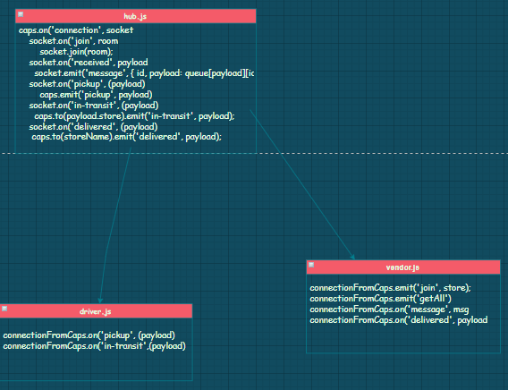

# queue-messages

* Author : MARAM
* Setup : .env =>{ store name, address, customer name, order id }
* Running the app : node caps.js + node driver.js + node vendor.js
* Endpoint : /caps
* Test : using jest >> npm test
* 